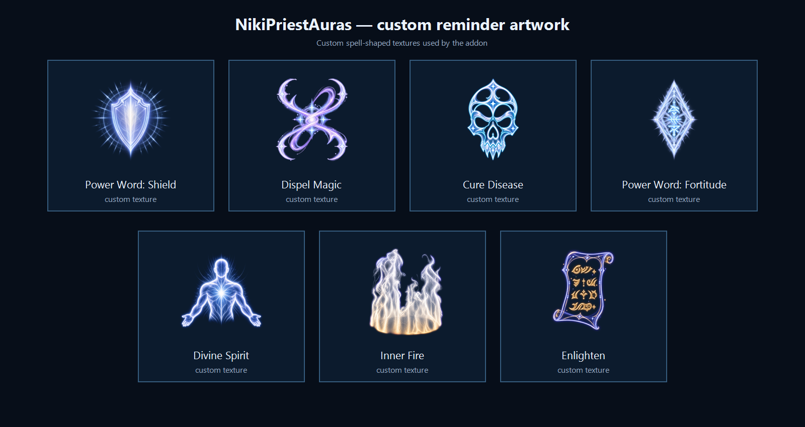
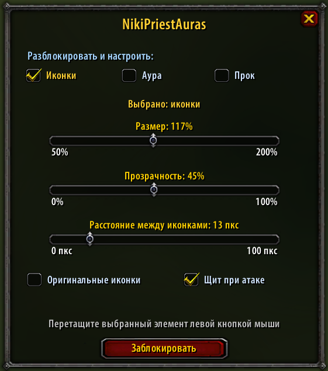

# NikiPriestAuras

**A Smite Priest addon for Turtle WoW / RavenCraft 1.18+.**

Animated combat, buff and proc reminders designed to work alongside pfUI,
SuperWoW and Nampower on the Vanilla 1.12 client API.

NikiPriestAuras shows only reminders the player can act on: missing buffs,
dispellable effects, `Power Word: Shield` status, the `Searing Light` proc and
the active `Enlightened` aura. Locked elements are click-through and all
reminders automatically hide during taxi flights.



## Features

- `Dispel Magic` reminder for a magic debuff on the player or a friendly target,
  and for a removable magic buff on a hostile target.
- `Cure Disease` reminder for a disease on the player or a friendly target.
- Missing-buff reminders for `Power Word: Fortitude`, `Inner Fire`,
  `Divine Spirit` and `Enlighten`.
- `Enlighten` is checked only on the player, so casting it on another party
  member does not keep the player's reminder permanently active.
- `Power Word: Shield` reminder when a creature is attacking the player and the
  shield is missing or has five seconds or less remaining.
- Smooth shield-icon pulsing while `Weakened Soul` prevents a recast.
- Optional player-frame shield durability estimate in the
  `remaining / maximum` format, with warning colors at low strength. The
  display supports both pfUI and the original Blizzard player frame.
- Animated `Searing Light` proc with flowing waves, pulsing light, a screen-edge
  glow and a short expanding fade after the proc is consumed by `Smite`.
- Animated hollow `Enlightened` aura with irregular light rays of varied
  length and brightness. It keeps the character visible, rotates and pulses
  faster as the buff approaches expiration.
- Custom spell-shaped reminder artwork or the original spell icons.
- Independent position, size and opacity settings for the central icon group,
  `Enlightened` aura and `Searing Light` proc.
- Configurable spacing between central icons and configurable proc animation
  speed.

## Screenshots

### Settings window



The screenshot was captured on a Russian client. The addon automatically uses
the Russian settings interface on `ruRU` clients and English on every other
client locale.

### Searing Light artwork


## Compatibility

| Component | Status |
|---|---|
| Turtle WoW 1.18.1 / Vanilla API 1.12 | Supported |
| pfUI | Supported; shield numbers can use the pfUI player frame |
| Original Blizzard UI | Supported; shield numbers can use the stock player frame |
| SuperWoW / SuperAPI | Supported |
| Nampower | Recommended for more accurate effect and damage information |

All integrations are optional dependencies. Core reminders continue to work
without them, although some extended information may be unavailable.

## Installation

1. Download the ZIP from the GitHub **Releases** page.
2. Extract the `NikiPriestAuras` folder into:

   ```text
   Interface\AddOns\NikiPriestAuras
   ```

3. Fully restart the client after the first installation. `/reload` is normally
   enough after an update that does not add a brand-new texture file.

The final path must look like this:

```text
Interface\AddOns\NikiPriestAuras\NikiPriestAuras.toc
```

## Settings

Run `/npa set`. The settings window lets you select one of three independently
configured elements:

- **Icons** — position, size, opacity and spacing between icons.
- **Aura** — enable/disable, position, size and opacity of the `Enlightened`
  aura.
- **Proc** — position, size, opacity and animation speed of `Searing Light`.

Drag the selected element with the left mouse button. Press **Lock** to save
the position, close the settings window and restore click-through behavior.

The two checkboxes at the bottom control:

- **Original spell icons** — switch between the custom artwork and original
  spell textures.
- **Shield while attacked** — enable or disable the `Power Word: Shield`
  combat reminder.

The **Shield numbers on player frame** selector chooses where the durability
counter replaces health while `Power Word: Shield` is active:

- **pfUI** — use the pfUI player frame.
- **Blizzard (original)** — use the stock Blizzard player frame.

The addon restores the normal health value as soon as the shield expires or
when the other frame mode is selected.

### Interface language

- Russian client (`ruRU`): Russian settings interface.
- Any other client locale: English settings interface.

No manual language selection is required.

## Commands

| Command | Action |
|---|---|
| `/npa` | Show the available command list |
| `/npa show` | Enable all addon visuals |
| `/npa hide` | Hide and persistently disable all addon visuals |
| `/npa set` | Open the settings window |
| `/npa reset` | Reset the central icon group position |
| `/npa test` | Preview `Searing Light` for 10 seconds |

These are the only public slash commands. Size, opacity, position, spacing,
animation and display options are configured through `/npa set`.

## Development and packaging

The addon targets the Lua and UI API provided by Vanilla 1.12. Later-client
APIs must not be used without a compatible fallback.

Build the installable archive locally with:

```powershell
./tools/package.ps1
```

The archive is written to `dist/`. GitHub Actions performs the same validation
and uploads the ZIP as a workflow artifact. Pushing a tag in the `vX.Y.Z`
format also publishes a GitHub Release with the packaged addon attached.

## Reporting problems

When opening a bug report, include:

- addon version;
- client/server version;
- whether pfUI, SuperWoW and Nampower are installed;
- exact reproduction steps;
- the complete Lua error and a screenshot when available.

## License and disclaimer

Released under the [MIT License](LICENSE). This is an unofficial fan-made addon
and is not affiliated with Blizzard Entertainment or Turtle WoW. World of
Warcraft names and game assets belong to their respective owners.
